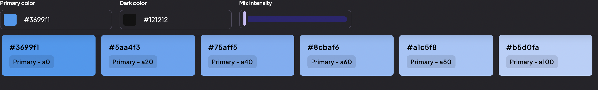
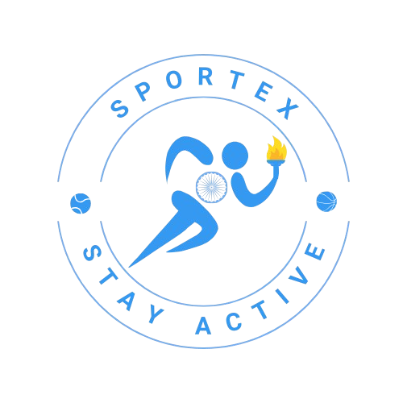

# 📱 **Sportex Application**

Sportex is a robust fitness tracking application that empowers users to monitor their physical fitness, set personalized goals, and engage in tailored workout programs. Whether it's muscular strength, endurance, or cardiovascular health, Sportex helps users achieve their fitness aspirations with ease. 💪✨

---

## 🌟 **Features and Scope**

### **1. Main Menu** 🏠
- **Weekly Summary:** 📊 Displays completed workouts and calories burned so far.
- **Today’s Plan:** 🗓️ Highlights the active goals and planned workouts for the day.
- **Settings:** ⚙️ Provides customization options for the app.
- **Navigation Bar:** 🚀 Offers quick navigation to other sections of the app.

---

### **2. Profile** 🧑‍💻
- Displays user information such as:
  - 👤 Age, Name, Height, Weight, and more.
- Tracks completed goals and achievements 🏆.
- Includes a **navigation bar** 🚀 for seamless app exploration.

---

### **3. Planner** 📅
- A **calendar view** for scheduling workouts and goals.
- Allows users to:
  - 📥 Add workouts and goals.
  - 🔎 View upcoming goals and workouts.
- Equipped with a **navigation bar** 🚀 for ease of access.

---

### **4. Goal Page** 🎯
- Displays **active and upcoming goals.**
- Users can:
  - ✏️ Edit existing goals.
  - ❌ Delete completed or irrelevant goals.
  - ✅ Mark goals as completed.
- Includes a **navigation bar** 🚀 for easy navigation.

---

### **5. Workout Page** 🏋️
- Displays **active and upcoming workouts.**
- Users can:
  - ✏️ Edit existing workouts.
  - ❌ Delete completed or irrelevant workouts.
  - ✅ Mark workouts as completed.
- Includes a **bottom navigation bar** 🚀 for smooth app operation.

---

### **6. Workout/Goal Creation** 📝
A dedicated page for creating workouts or goals with fields like:
- 🏷️ Name
- 🧭 Type of workout/goal
- ⏳ Deadline
- 📖 Description
- 🤖 **AI Assistance:** Suggests workouts based on fitness objectives (e.g., weight loss, strength training).

---

### **7. Login & Register Screens**

**🔑 Login Screen:**
- Users can:
  - 🛡️ Log in with their **username** and **password.**
  - 🔀 Redirect to the main menu upon successful login.
  - 🚪 Navigate to the **register screen** for new users.

**🆕 Register Screen:**
- Allows users to:
  - Create an account by providing their **username**, **password**, and **personal details**.
  - 🗄️ Store user data persistently using DataStore (appears on the Profile Screen).
  - 🔀 Redirect to the main menu after successful registration.

---

## 💾 **Data Persistence**

Sportex uses **DataStore** for data persistence. The application leverages **Gson** for serializing and deserializing complex data types like `Workout` and `Goal` into JSON strings.

### 🔄 **How Data is Stored**
#### **Gson Library:**
- 🛠️ Converts `Workout` and `Goal` objects into **JSON strings** for storage.
- 🔍 Converts **JSON strings** back into objects during retrieval.

#### **DataStore:**
- 🗄️ Stores serialized JSON strings for **workouts, goals, and user data.**
- 📌 Ensures data persists across app restarts.

---

## 🛠️ **Key Data Operations**

### **Workouts** 🏋️‍♀️
- ➕ **Add:** Add new workouts with relevant details.
- ✏️ **Edit:** Modify an existing workout's details.
- ❌ **Delete:** Remove a workout.
- ✅ **Complete:** Mark a workout as completed. The status persists across app restarts.

### **Goals** 🎯
- ➕ **Add:** Add new goals with relevant details.
- ✏️ **Edit:** Modify an existing goal's details.
- ❌ **Delete:** Remove a goal.
- ✅ **Complete:** Mark a goal as completed. The status persists across app restarts.

---

## 🎨 **Application Design**

### **Color Theme** 🎨
Modern and visually appealing color palette for an intuitive user experience.

  

### **Application Logo** 🏋️‍♂️
Unique and professional logo reflecting the spirit of fitness.

## 🚀 Getting Started

**1️⃣- Clone the repository:**  
 git clone https://github.com/YourUsername/Sportex.git  
**2️⃣- Open the project in Android Studio.**  
**3️⃣- Build and run the app on an emulator or physical device.**

## 📦 Dependencies

### Libraries Used:
 **- 📜 Gson:**   
For serialization and deserialization of Workout and Goal objects.   
Official documentation: [Gson](https://medium.com/@hissain.khan/parsing-with-google-gson-library-in-android-kotlin-7920e26f5520)
**- 💾 DataStore:**   
For storing and retrieving persistent key-value data.  

## 🤝 Contributors

Developed by **Team Longfoot** 🚀:  

👩‍💻 Rita Youssef   
👩‍💻 Naomie Edward   
👨‍💻 Eric Stoian   
👨‍💻 Alexander Burlec-Plaies   
